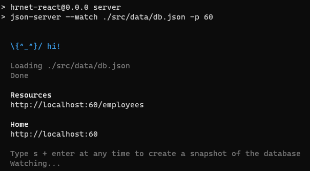
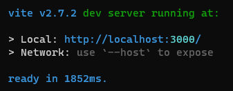
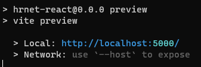

# React Version of the HRNet web application

## Installation

Clone this repository

- `git clone https://github.com/TriupLauro/KestelmanValentin_14_15122021.git`
- Or within an IDE

Install dependencies

`npm install` 

## Running the app

### Launch the 'back-end'

`npm run server`

You should see this

### Launch the app itself

You can launch the app as a dev server or as a preview of the prod build

#### As a dev server

In a new terminal window

`npm run dev`

Then go to http://localhost:3000/ in your browser

The dev server does not optimize performance.

#### As a prod server

In order to get the best performance, build and preview

- `npm run build`
- `npm run preview`

Then go to http://localhost:5000/ in your browser